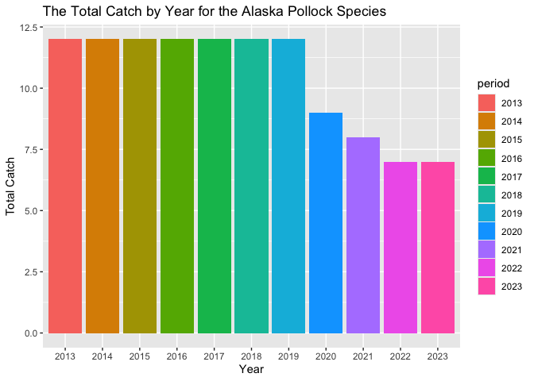
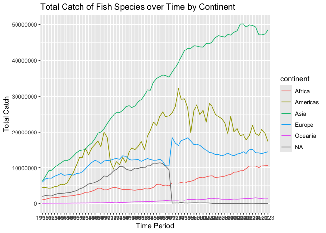

## Instructions
Answer the following questions and/or complete the exercises in RMarkdown. Please embed all of your code and push the final work to your repository. Your report should be organized, clean, and run free from errors. Remember, you must remove the `#` for any included code chunks to run.  

## Load the libraries

``` r
library("tidyverse")
library("janitor")
#library("naniar")
options(scipen = 999)
```

## About the Data
For this assignment we are going to work with a data set from the [United Nations Food and Agriculture Organization](https://www.fao.org/fishery/en/collection/capture) on world fisheries. These data were downloaded and cleaned using the `fisheries_clean.Rmd` script.  

Load the data `fisheries_clean.csv` as a new object titled `fisheries_clean`.

``` r
fisheries_clean <- read_csv("data/fisheries_clean.csv")
```

1. Explore the data. What are the names of the variables, what are the dimensions, are there any NA's, what are the classes of the variables, etc.? You may use the functions that you prefer.

``` r
names(fisheries_clean)
```

```
## [1] "period"          "continent"       "geo_region"      "country"        
## [5] "scientific_name" "common_name"     "taxonomic_code"  "catch"          
## [9] "status"
```

``` r
dim(fisheries_clean)
```

```
## [1] 1055015       9
```

``` r
glimpse(fisheries_clean)
```

```
## Rows: 1,055,015
## Columns: 9
## $ period          <dbl> 1950, 1951, 1952, 1953, 1954, 1955, 1956, 1957, 1958, …
## $ continent       <chr> "Asia", "Asia", "Asia", "Asia", "Asia", "Asia", "Asia"…
## $ geo_region      <chr> "Southern Asia", "Southern Asia", "Southern Asia", "So…
## $ country         <chr> "Afghanistan", "Afghanistan", "Afghanistan", "Afghanis…
## $ scientific_name <chr> "Osteichthyes", "Osteichthyes", "Osteichthyes", "Ostei…
## $ common_name     <chr> "Freshwater fishes NEI", "Freshwater fishes NEI", "Fre…
## $ taxonomic_code  <chr> "1990XXXXXXXX106", "1990XXXXXXXX106", "1990XXXXXXXX106…
## $ catch           <dbl> 100, 100, 100, 100, 100, 200, 200, 200, 200, 200, 200,…
## $ status          <chr> "A", "A", "A", "A", "A", "A", "A", "A", "A", "A", "A",…
```

2. Convert the following variables to factors: `period`, `continent`, `geo_region`, `country`, `scientific_name`, `common_name`, `taxonomic_code`, and `status`.

``` r
fisheries_clean <- fisheries_clean %>%
  mutate(across(c(period, continent, geo_region, country, scientific_name, common_name, taxonomic_code, status), as.factor))
```

3. Are there any missing values in the data? If so, which variables contain missing values and how many are missing for each variable?


4. How many countries are represented in the data?

``` r
fisheries_clean %>%
  distinct(country) %>%
nrow()
```

```
## [1] 249
```

5. The variables `common_name` and `taxonomic_code` both refer to species. How many unique species are represented in the data based on each of these variables? Are the numbers the same or different?

``` r
fisheries_clean %>%
  group_by(common_name, taxonomic_code) %>%
  distinct(common_name) %>%
  count()
```

```
## # A tibble: 3,722 × 3
## # Groups:   common_name, taxonomic_code [3,722]
##    common_name               taxonomic_code     n
##    <fct>                     <fct>          <int>
##  1 Aba                       117806101001       1
##  2 Abalones NEI              3701112010XX       1
##  3 Abu mullet                165001109001       1
##  4 Abyssal smooth-head       121514007801       1
##  5 Abyssal spiderfish        145504101403       1
##  6 Acadian redfish           172525111418       1
##  7 Acoupa weakfish           182006107401       1
##  8 Adriatic sole             155220107003       1
##  9 Aesop shrimp              228927103410       1
## 10 African armoured searobin 172520103401       1
## # ℹ 3,712 more rows
```

The numbers are different.

6. In 2023, what were the top five countries that had the highest overall catch?

``` r
fisheries_clean %>%
  filter(period == "2023") %>%
  select(country, catch) %>%
    group_by(country) %>%
  summarize(across(where(is.numeric), ~sum(.x, na.rm=T))) %>%
  arrange(desc(catch)) %>%
   slice_head(n=5)
```

```
## # A tibble: 5 × 2
##   country                      catch
##   <fct>                        <dbl>
## 1 China                    13424705.
## 2 Indonesia                 7820833.
## 3 India                     6177985.
## 4 Russian Federation        5398032 
## 5 United States of America  4623694
```

  China, Indonesia, India, the Russian Federation, and the USA were the top 5 countries with the highest overall catch.


7. In 2023, what were the top 10 most caught species? To keep things simple, assume `common_name` is sufficient to identify species. What does `NEI` stand for in some of the common names? How might this be concerning from a fisheries management perspective?

``` r
fisheries_clean %>%
  filter(period == "2023") %>%
  select(common_name, catch) %>%
    group_by(common_name) %>%
  summarize(across(where(is.numeric), ~sum(.x, na.rm=T))) %>%
  arrange(desc(catch)) %>%
   slice_head(n=10)
```

```
## # A tibble: 10 × 2
##    common_name                       catch
##    <fct>                             <dbl>
##  1 Marine fishes NEI              8553907.
##  2 Freshwater fishes NEI          5880104.
##  3 Alaska pollock(=Walleye poll.) 3543411.
##  4 Skipjack tuna                  2954736.
##  5 Anchoveta(=Peruvian anchovy)   2415709.
##  6 Blue whiting(=Poutassou)       1739484.
##  7 Pacific sardine                1678237.
##  8 Yellowfin tuna                 1601369.
##  9 Atlantic herring               1432807.
## 10 Scads NEI                      1344190.
```

  NEI stands for "Not Elsewhere Identified", and in fisheries data this means that the catch could not be assigned or identified to a particular species, and it is grouped under a broader taxonomic category. This is concerning from a fisheries management perspective because it overshadows which species are actually being harvested, increasing the risk of overfishing for vulnerable fish species.


8. For the species that was caught the most above (not NEI), which country had the highest catch in 2023?

``` r
fisheries_clean %>%
  filter(period == "2023" & common_name == "Alaska pollock(=Walleye poll.)") %>%
  select(common_name, catch, country) %>%
    group_by(country) %>%
  summarize(across(where(is.numeric), ~sum(.x, na.rm=T))) %>%
  arrange(desc(catch)) %>%
   slice_head(n=1)
```

```
## # A tibble: 1 × 2
##   country              catch
##   <fct>                <dbl>
## 1 Russian Federation 1893924
```
The Russian Federation had the highest catch in 2023.

9. How has fishing of this species changed over the last decade (2013-2023)? Create a  plot showing total catch by year for this species.

``` r
fisheries_clean %>%
  select(catch, period, common_name) %>%
filter(period == 2013 | period == 2014 | period == 2015 | period == 2016 | period == 2017 | period == 2018 | period == 2019 | period == 2020 | period == 2021 | period == 2022 | period == 2023) %>%
  filter(common_name == "Alaska pollock(=Walleye poll.)") %>%
  ggplot(mapping=aes(x=period)) +
  geom_bar(mapping=aes(fill=period)) +
  labs(title = "The Total Catch by Year for the Alaska Pollock Species", x = "Year", y = "Total Catch")
```

<!-- -->

There is an overall trend of reduction in the fishing of this particular species over this decade, likely suggesting an underlying factor of overfishing and the need to protect this population.

10. Perform one exploratory analysis of your choice. Make sure to clearly state the question you are asking before writing any code.

How has total catch changed over time period across different continents?

``` r
fisheries_clean %>%
  group_by(period, continent) %>%
  summarize(total_catch = sum(catch, na.rm = T)) %>%
  ggplot(aes(x=period, y = total_catch, group = continent)) +
  geom_line(mapping=aes(color=continent)) +
  labs(title = "Total Catch of Fish Species over Time by Continent", x = "Time Period", y = "Total Catch")
```

```
## `summarise()` has grouped output by 'period'. You can override using the
## `.groups` argument.
```

<!-- -->

## Knit and Upload
Please knit your work as an .html file and upload to Canvas. Homework is due before the start of the next lab. No late work is accepted. Make sure to use the formatting conventions of RMarkdown to make your report neat and clean!  
